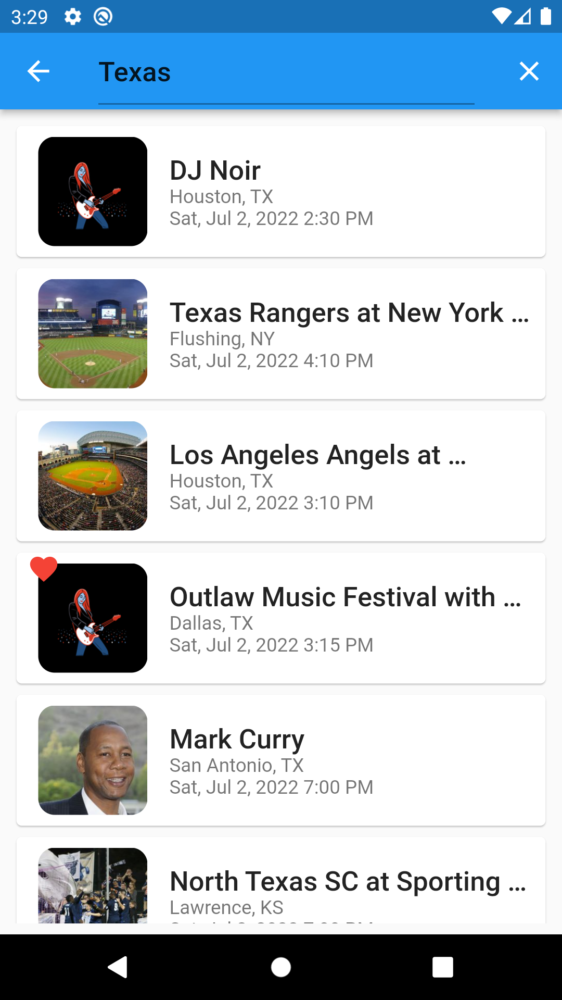
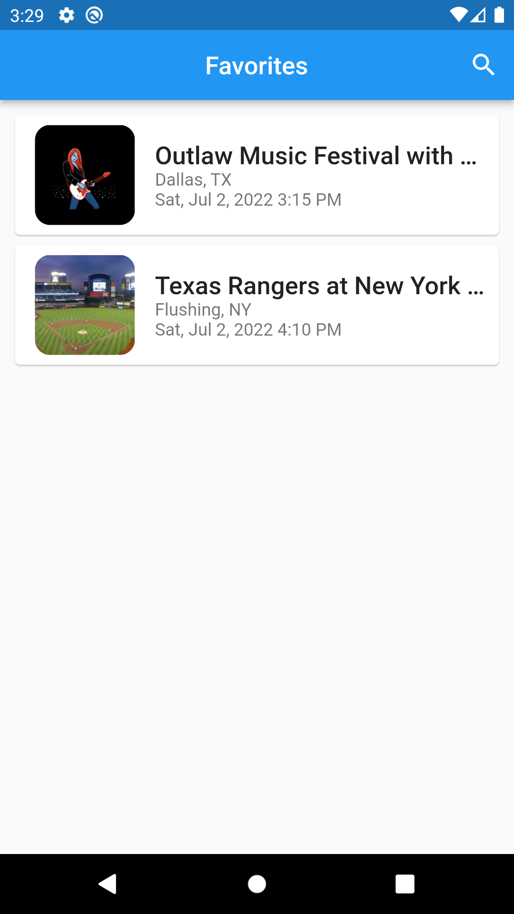
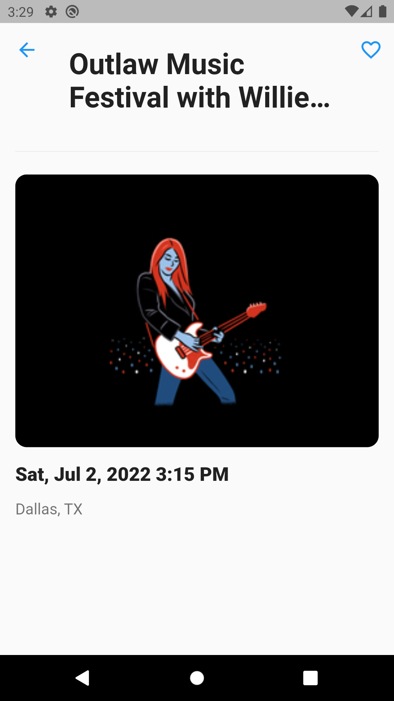

# seat_geek_browser

A Flutter application for searching events through [Seat Geek API](http://platform.seatgeek.com/)

  

## Features

- Search for available events and view them
- Add to favorites and check them offline

## Prerequisites

[ObjectBox](https://pub.dev/packages/objectbox) NoSQL database is used to store favorites. The following command should be run for the first time before running the project through IDE.

     flutter pub run build_runner build
